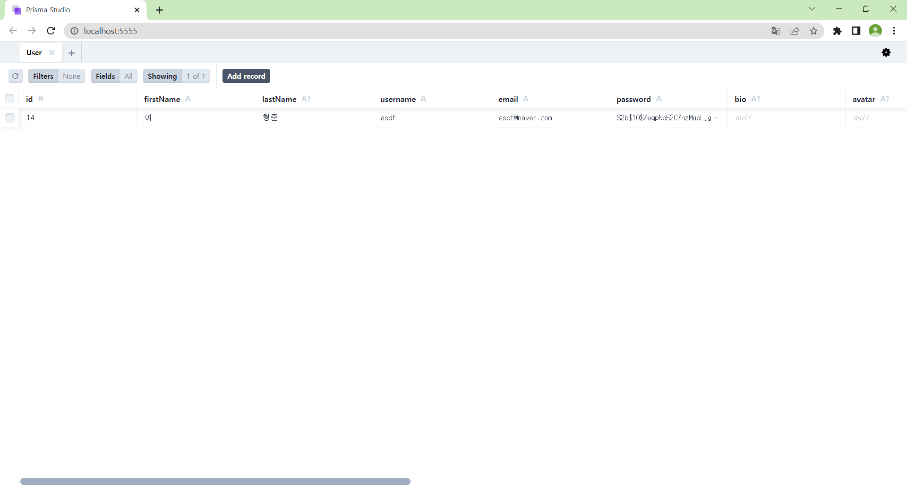

  
## 진행 상황 (~ 23.02.23)

</img> 

간단한 회원가입 및 로그인 구현 
Tab bar를 이용하여 앱의 대략적인 구조만 구현해두었다. (화면 전환) 

 
 

</img> 

DB에 정보가 정상적으로 등록되는 것을 확인할 수 있다. 

 
 

### 해야할 일

Component들을 어떻게 배치할 것인지 구체적인 논의가 필요하다. 

 
 
  
## Repository 링크 정리

 
  
### 공부/테스트용 Repository
  
<a href="https://github.com/yeohj07-sub/app-practice-backend" target="_blank">백엔드 공부 및 테스트</a> 
<a href="https://github.com/yeohj07-sub/app-practice-native" target="_blank">프론트엔드 (어플리케이션) 공부 및 테스트</a> 
<a href="https://github.com/yeohj07-sub/app-practice-web" target="_blank">프론트엔드 (웹) 공부 및 테스트</a> 

 

### 실제 개발 및 배포용 Repository

<a href="https://github.com/yeohj07-sub/backend" target="_blank">백엔드</a> 
<a href="https://github.com/yeohj07-sub/native" target="_blank">프론트엔드 (어플리케이션)</a> 
<a href="https://github.com/yeohj07-sub/web" target="_blank">프론트엔드 (웹)</a> 

 
 

## 기타

### 배포 (Deployment)

- [x] 클라우드 : AWS  
- [x] 백엔드 배포 : Heroku  
- [x] 프론트엔드 (web) 배포 : Netlify  
- [x] 어플리케이션 배포 : Expo + (???) 
- [x] 도메인 연결 : 가비아 + Cloudflare  
- [ ] 플레이스토어 어플리케이션 등록 : 이건 비용을 꽤 내야해서 아직  

 
 

### 예시 디자인

 

</img> 

