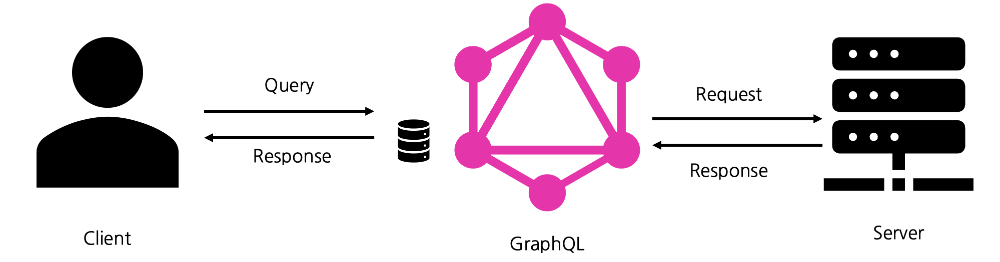
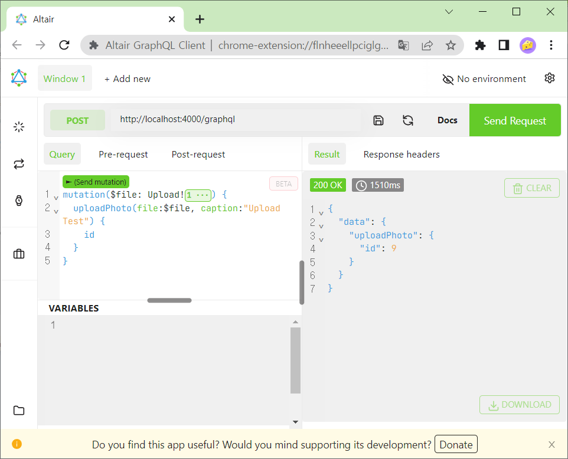
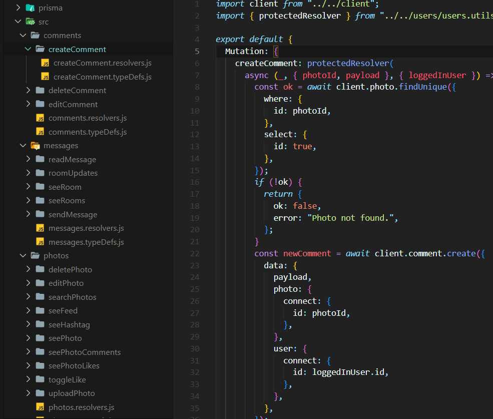
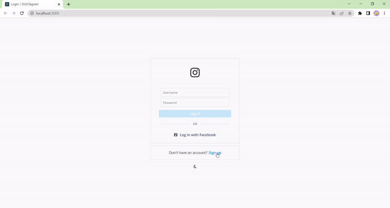

  
## 진행 상황

 

### GraphQL

</img> 
 
데이터를 간단하게 묶어서 전달하는 하나의 방법 

 
 

</img> 
 
쿼리 중 하나의 예시 (이러한 처리들을 앱의 버튼이나 입력을 통해 작동할 수 있도록 연결하는 과정을 공부) 

 
 

</img> 
 
GraphQL을 이용한 여러 가지 백엔드 작업을 구현해보고 필요한 부분을 거의 비슷하게 가져와서 적용할 예정입니다. 

 
 

</img> 
 
위의 쿼리들을 웹에 적용해 본 예시입니다. 

앱 작업 역시 현재 공부중에 있습니다. 
React Native로 구현하는 앱은 React로 구현된 웹 페이지와 비슷한 점이 많아 어느 정도는 단기간에 구현할 수 있을 것으로 예상합니다. 

 
 

### 배포 (Deployment)

- [x] 클라우드 : AWS  
- [x] 백엔드 배포 : Heroku  
- [x] 프론트엔드 (web) 배포 : Netlify  
- [x] 어플리케이션 배포 : Expo + (???) 
- [x] 도메인 연결 : 가비아 + Cloudflare  
- [ ] 플레이스토어 어플리케이션 등록 : 이건 비용을 꽤 내야해서 아직  

 
 

### 사업계획서 첨부용 예시 디자인
</img> 
 
프론트엔드 디자인은 이런 방식으로 상대적으로 단기에 제작 가능합니다. 
시간이 부족하다면 디자인을 먼저 진행한 이후에 백엔드와의 연결 작업을 따로 거쳐주는 방법도 괜찮을 것 같습니다. 

 
 

## 추후 계획

2월 안에 앱의 기본적인 형태를 완성하는 쪽으로 노력해보겠습니다. 
휴대폰 본인인증 (아임포트) + PG (전자결제) 쪽은 그 이후에 시도해봐야 할 것 같습니다. 

 
 

  
## Repository 링크 정리

 
  
### 공부/테스트용 Repository
  
<a href="https://github.com/yeohj07-sub/app-practice-backend" target="_blank">백엔드 공부 및 테스트</a> 
<a href="https://github.com/yeohj07-sub/app-practice-native" target="_blank">프론트엔드 (어플리케이션) 공부 및 테스트</a> 
<a href="https://github.com/yeohj07-sub/app-practice-web" target="_blank">프론트엔드 (웹) 공부 및 테스트</a> 

 

### 실제 개발 및 배포용 Repository

<a href="https://github.com/yeohj07-sub/backend" target="_blank">백엔드</a> 
<a href="https://github.com/yeohj07-sub/native" target="_blank">프론트엔드 (어플리케이션)</a> 
<a href="https://github.com/yeohj07-sub/web" target="_blank">프론트엔드 (웹)</a> 

 
 

